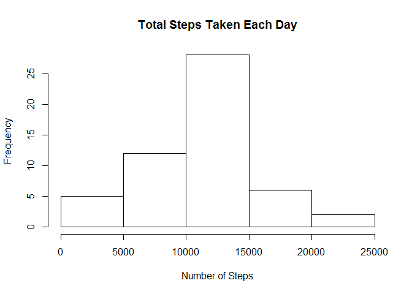
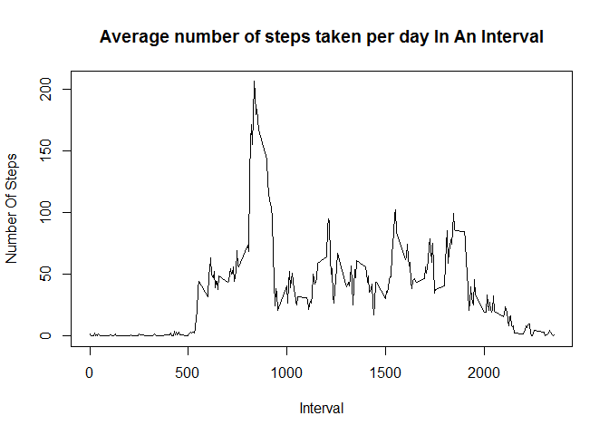
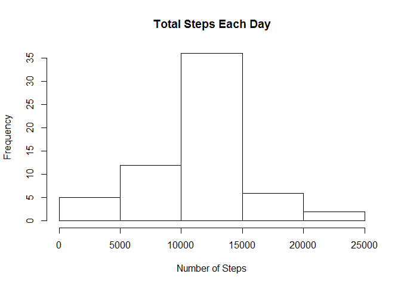
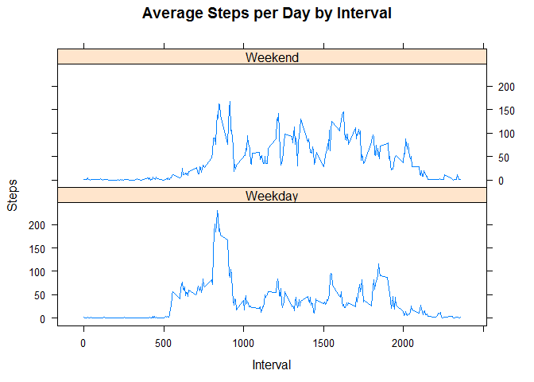

# Reproducible Research: Peer Assessment 1


## Loading and preprocessing the data
  
####-Loading the data  


```r
if(!file.exists('activity.csv')){
    unzip('activity.zip')
}
data <- read.csv("activity.csv")
```

  
## What is mean total number of steps taken per day?

####-Calculate the total number of steps taken per day

The total number of steps taken each day can be calculated by aggregating the steps according to date.


```r
stepsPerDay <- aggregate(steps ~ date, data, sum)
hist(stepsPerDay$steps, main = paste("Total Steps Taken Each Day"), xlab="Number of Steps")
```

 

####-Calculate and report the mean and median of the total number of steps taken per day


```r
meanStepsPerDay <- mean(stepsPerDay$steps)
medianStepsPerDay <- median(stepsPerDay$steps)
```

The mean steps taken per day are 1.0766189\times 10^{4} and the median steps per day are 10765.

## What is the average daily activity pattern?

####-Make a time series plot (i.e. type = "l") of the 5-minute interval (x-axis) and the average number of steps taken, averaged across all days (y-axis)


```r
stepsAveragedByInterval <- aggregate(steps ~ interval, data, FUN = mean)
plot(stepsAveragedByInterval, type = "l", xlab = "Interval", 
    ylab = "Number Of Steps", main = "Average number of steps taken per day In An Interval")
```

 

####-Which 5-minute interval, on average across all the days in the dataset, contains the maximum number of steps?


```r
max <- which.max(stepsAveragedByInterval$steps)
maxInterval <- stepsAveragedByInterval[max,1]
```

The 5-minute interval, on average across all the days in the dataset, containing the maximum number of steps is 835.


## Imputing missing values

####-Calculate and report the total number of missing values in the dataset (i.e. the total number of rows with NAs)
  

```r
NoOfIncompleteRows <- sum(!complete.cases(data))
```

The total number of rows with NAs are 2304.

####-Devise a strategy for filling in all of the missing values in the dataset. The strategy does not need to be sophisticated. For example, you could use the mean/median for that day, or the mean for that 5-minute interval, etc.

The missing values in the dataset were replaced by the mean for that 5-minute interval. 


```r
library(plyr)
impute.mean <- function(x) replace(x, is.na(x), mean(x, na.rm = TRUE))
```


####-Create a new dataset that is equal to the original dataset but with the missing data filled in.


```r
imputedData <- ddply(data, ~ interval, transform, steps = impute.mean(steps))
```


####-Make a histogram of the total number of steps taken each day and Calculate and report the mean and median total number of steps taken per day. 


```r
imputedSteps <- aggregate(steps ~ date, imputedData, sum)
hist(imputedSteps$steps, main = paste("Total Steps Each Day"), xlab="Number of Steps")
```

 

```r
meanImputedStepsPerDay <- mean(imputedSteps$steps)
medianImputedStepsPerDay <- median(imputedSteps$steps)
```

The mean steps taken per day are 1.0766189\times 10^{4} and the median steps per day are 1.0766189\times 10^{4}. The estimates increased slightly.


## Are there differences in activity patterns between weekdays and weekends?

####-Create a new factor variable in the dataset with two levels - "weekday" and "weekend" indicating whether a given date is a weekday or weekend day.


```r
library(lattice)
imputedData$weekend <- weekdays(as.Date(imputedData$date)) %in% c("Saturday", "Sunday")
imputedData[imputedData$weekend == T, ]$weekend <- "Weekend"
imputedData[imputedData$weekend == F, ]$weekend <- "Weekday"
imputedData$weekend<-as.factor(imputedData$weekend)
```


####-Make a panel plot containing a time series plot (i.e. type = "l") of the 5-minute interval (x-axis) and the average number of steps taken, averaged across all weekday days or weekend days (y-axis). 


```r
averagedImputedData <- aggregate(steps ~ interval + weekend, imputedData, mean)
xyplot(averagedImputedData$steps ~ averagedImputedData$interval|averagedImputedData$weekend, main="Average Steps per Day by Interval",xlab="Interval", ylab="Steps",layout=c(1,2), type="l")
```

 


